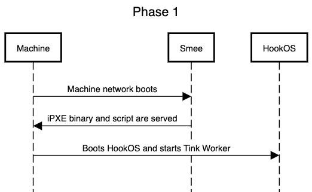
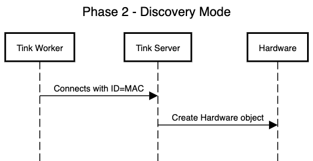
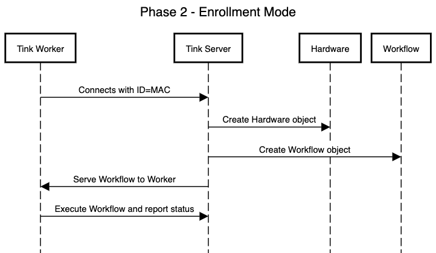

# Automatic Capabilities in Tinkerbell

## Introduction

There are two major phases in the provisioning process. The first one is the network boot phase. The second is the Workflow execution phase. Currently, the network boot phase requires the existence of a Hardware object. The Workflow execution phase doesn't have a hard requirement on a Hardware object but it is needed in order to use the templating features of a Template. The Hardware object also feeds into the setting of the Tink Worker ID needed to identify the Workflow that should be run. Neither the Hardware nor the Workflow are automatically generated. This means a User must prepopulate both of these objects before network booting and running a Workflow on a machine. It's also important to note that Workflows are currently a 1 to 1 mapping. One workflow to one Tink Worker ID.

### Context

As Tinkerbell is designed to provision large datacenters with up to many thousands of machines, predefining the initial Hardware and Workflow for machines at scale becomes a significant impediment.

### Scope

This design doc will cover automatic capabilities for both of the major provisioning phases.

## Goals

- Automatic network booting for machines without the need of a predefined Hardware object.
- Automatic running of a single predefined Workflow for all discovered machines.
- Automatic creation of minimal Hardware objects.
- Automatic creation of a single enrollment Workflow per discovered Hardware object.

### Non goals

- Dynamically assigning a Template to a Workflow.
- Dynamically assigning Hardware to a Workflow.
- Detailed Hardware object population.

## Design

### Phase 1

The automatic capabilities during this phase are isolated to the Smee service. This design will extent the current proxyDHCP capability of Smee to enable serving a static `auto.ipxe` script for all network boot clients. The static script will set the Tink Worker ID to the MAC address of the interface that is network booting. The machine leaves this phase with HookOS up and running and Tink Worker running and connected to Tink Server.

### Phase 2

This phase consists of 2 modes. Ignore the naming of these modes as they can change if we don't like them. The automatic capabilities during this phase are isolated the Tink Server and Worker. In this phase "unknown" is defined as there is no Hardware object associated with the Tink Worker ID (MAC address).

#### Discovery Mode

This mode is called discovery. This is when an unknown Tink Worker connects to the Tink Server. Tink Server will create a Hardware object for this Tink Worker ID. The Tink Worker will then be ready to run a Workflow. The Tink Worker will not have a Workflow automatically created. This mode will only run if a Hardware object for the corresponding Tink Worker ID does not exist.

#### Enrollment Mode

This mode is enrollment. This is when an unknown Tink Worker connects to the Tink Server. Tink Server will create a Hardware object. Tink Server will also create a Workflow with the newly created Hardware object and using a single predefined Template. The creation of this Workflow and the connected Tink Worker will cause that the Workflow will start running right away. This mode will only run if a Hardware object for the corresponding Tink Worker ID does not exist.

### Sequence Diagrams

#### Phase 1



#### Phase 2





## Alternatives

1. Instead of putting the responsibility of Hardware and Workflow creation with Tink Server we put the responsibility with Smee.
1. Instead of implementing phase 2 based on an unknown Tink Worker connecting to Tink Server, we implement one to many Workflow to Tink Worker functionality. Things like a TemplateRuleSets and/or HardwareRuleSets for Template and Hardware matching could be used to accomplish this. A Tink Worker connects to Tink Server, providing characteristics/labels about itself, and Tink Server provides a Workflow that has a Template that meets the rules provided in the TemplateRuleSet. The Tink Worker then runs the Workflow and reports back the status.
1. The discovery mode of phase 2 is the responsibility of the Tink Worker. The Tink Worker is provided access to create its own Hardware object. This option could be coupled with option 2 for running the Workflow.

## Appendix

Phase 1 UML:

```UML
title Phase 1

participant Machine
participant Smee
participant HookOS

Machine->Smee:Machine network boots
Smee->Machine: iPXE binary and script are served

Machine->HookOS: Boots HookOS and starts Tink Worker
```

Phase 2 - Discovery Mode UML:

```UML
title Phase 2 - Discovery Mode

participant Tink Worker
participant Tink Server
participant Hardware

Tink Worker->Tink Server: Connects with ID=MAC
Tink Server->Hardware: Create Hardware object
```

Phase 2 - Enrollment Mode UML:

```UML
title Phase 2 - Enrollment Mode

participant Tink Worker
participant Tink Server
participant Hardware
participant Workflow

Tink Worker->Tink Server: Connects with ID=MAC
Tink Server->Hardware: Create Hardware object
Tink Server->Workflow: Create Workflow object
Tink Server->Tink Worker: Serve Workflow to Worker
Tink Worker->Tink Server: Execute Workflow and report status
```
