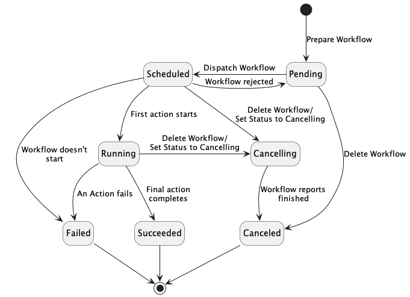
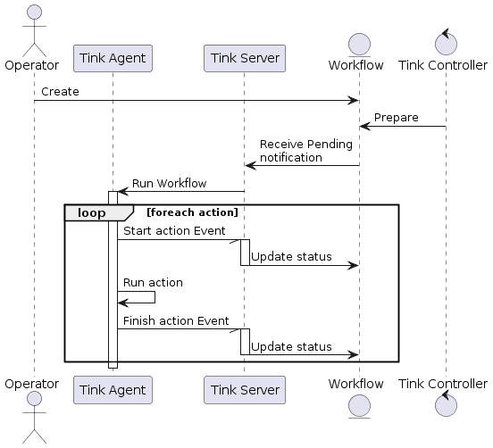
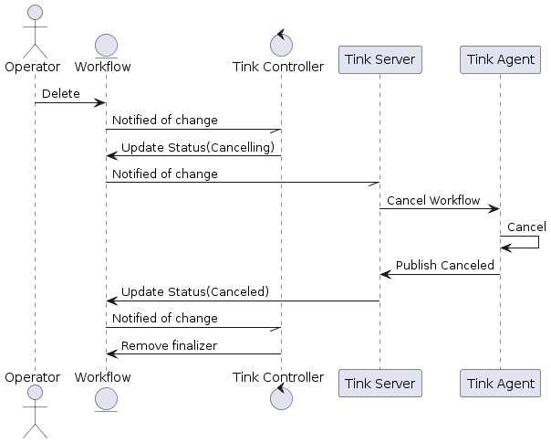

# Tinkerbell Workflow Execution

## Contents

- [Tinkerbell Workflow Execution](#tinkerbell-workflow-execution)
   * [Contents](#contents)
   * [Context](#context)
   * [Goals/Non-goals](#goalsnon-goals)
   * [Existing Solution](#existing-solution)
   * [Proposal](#proposal)
      + [Summary](#summary)
      + [Workflow States](#workflow-states)
         - [Why do we need the Scheduled state?](#why-do-we-need-the-scheduled-state)
         - [Why do we need the Cancelling state?](#why-do-we-need-the-cancelling-state)
      + [Executing Workflows](#executing-workflows)
         - [Service protobuf](#service-protobuf)
         - [Workflow Events](#workflow-events)
      + [Cancelling a Workflow](#cancelling-a-workflow)
      + [Handling a rejected Workflow](#handling-a-rejected-workflow)
   * [Failure Modes](#failure-modes)
      + [Supervising Workflows](#supervising-workflows)
      + [What happens if 2 Tink Agents connect to Tink Server with the same identifier?](#what-happens-if-2-tink-agents-connect-to-tink-server-with-the-same-identifier)
      + [What happens if 2 Workflows are dispatched to Tink Agent (double dispatch)?](#what-happens-if-2-workflows-are-dispatched-to-tink-agent-double-dispatch)
   * [Appendicies](#appendicies)
      + [Appendix A: Existing Protobuf](#appendix-a-existing-protobuf)
      + [Appendix B: Workflow Service Protobuf](#appendix-b-workflow-service-protobuf)

## Context

The Kubernetes backend was [introduced to Tinkerbell](https://github.com/tinkerbell/proposals/tree/28ad00608c176871a57d5a5519d9a3f4b9d1cf98/proposals/0026) and has subsequently become the only supported backend. The proposal outlined how the Kubernetes backend would integrate with the various Tinkerbell services but opted to maintain existing Workflow execution paradgims.

The [v1alpha2 API](https://github.com/tinkerbell/roadmap/blob/main/design/20230222_tinkerbell_crd_refactor.md) simplifies the Kubernetes API by removing unnecessary functionality such as Tasks (a feature for multi-worker workflows). However, the changes to the API that have seen entire features dropped have never been reflected in the code making it difficult to maintain.

## Goals/Non-goals

**Goals**
* Simplify the Tink Agent - Tink Server communication to what's necessary.
* Define the components involved in Workflow execution and their responsibilities.
* Provide clear behavioral expectations in failure cases.

**Non-goals**
* Introduce new functionality beyond that specified in the v1alpha2 API unless necessary for the new Workflow execution proposal.

## Existing Solution

Tinkerbell defines 3 core components involved with Workflow execution: Tink Worker, Tink Server and Tink Controller. Tink Worker runs on the target device and executes Workflow actions reporting the result of actions to Tink Server. On startup, Tink Worker connects to Tink Server providing a unique identifier that Tink Server uses to retrieve Workflows. As Tink Server receives the result of executing actions from Tink Worker, it updates the Workflow resource.

Tink Controller is responsible for preparing Workflows resources using Templates. When a user submits Hardware, Workflow and Template resources to the system, Tink Controller renders the Template storing the output on the Workflow so it can be updated as Workflow actions execute. Tink Controller bears no other responsibility.

Tink Worker communicates with Tink Server over gRPC. There are a handful of obsolete RPCs that are unimplemented in Tink Server since the transition to the Kubernetes backend (see Appendix A for existing protobuf).

## Proposal

### Summary

The components used in Workflow execution will remain similar to the existing solution. Tink Agent (renamed from Tink Worker) will run on the device to be provisioned and is responsible for executing Workflows. Tink Server will instruct Tink Agent to run and cancel Workflows, and will update Workflow status based on Workflow execution Events published by Tink Agent. Tink Controller will prepare Workflows for execution and monitor them for erroneous states taking any necessary remedial action. The architecture draws similarities with the [Scheduler-Agent-Supervisor](https://learn.microsoft.com/en-us/azure/architecture/patterns/scheduler-agent-supervisor) pattern.

### Workflow States

<p align="center">
  
</p>

#### Why do we need the Scheduled state?

The Scheduled state is an intermediary state that indicates a Workflow has been dispatched to Tink Agent but hasn't started. Tink Controller will monitor Workflows in a Scheduled state and transition them to Failed if a timeout trips.

Workflows may also be rejected by Tink Agent explicitly for cases such as a double dispatch. In the event a Workflow is rejected it will transition back to Pending. Workflow rejection is discussed later.

#### Why do we need the Cancelling state?

The Cancelling state separates Workflows we intend to cancel from those that have been cancelled. This allows Tink Server to issue a cancellation instruction to Tink Agent, and for Tink Agent to indicate successful cancellation. The explicitness of this sequence is useful because:
* It provides explicit indication that a Running Workflow has stopped making it clear that Tink Agent is available to run a subsequent Workflow.
* It makes clear to operators the state of the Workflow and why Tink Agent isn't executing a subsequent Workflow.

### Executing Workflows

Tink Server will continue to expose a gRPC API. The protobuf will be simplified to remove superfluous APIs and data structures. Tink Agent will connect to Tink Server to create a long lived command stream. When Tink Server identifies a runnable Workflow for a connected Tink Agent it will dispatch the Workflow on the command stream. Workflows are dispatched in the order they are created. As Tink Agent executes Workflow Actions it will publish events to Tink Server.

<p align="center">
  
</p>

#### Service protobuf

The Workflow Service exposes 2 APIs, 1 for establishing a command stream and 1 for publishing Workflow execution events. The full protobuf can be found in Appendix A.

```protobuf
// WorkflowService is responsible for retrieving workflows to be executed by the agent and
// publishing events as a workflow executes.
service WorkflowService {
  // GetWorkflows creates a stream that will receive workflows intended for the agent identified
  // by the GetWorkflowsRequest.agent_id.
  rpc GetWorkflows(GetWorkflowsRequest) returns (stream GetWorkflowsResponse) {}

  // PublishEvent publishes a workflow event.
  rpc PublishEvent(PublishEventRequest) returns (PublishEventResponse) {}
}
```

#### Workflow Events

| Event               | Description                                                                                     |
| ------------------- | ----------------------------------------------------------------------------------------------- |
| `ActionStarted`     | The action has begun executing                                                                  |
| `ActionSucceeded`   | The action has completed successfully                                                           |
| `ActionFailed`      | The action failed to complete. Appropriate failure reason and message will accompany the event  |
| `WorkflowRejected`  | Tink Agent has explicitly rejected the request to run the Workflow |

### Cancelling a Workflow

<p align="center">
  
</p>

Users cancel Workflows by deleting them. In response to the delete request, Tink Controller will transition the Workflow to Cancelling or Canceled (in the case of a Pending state).

It is necessary for the Tink Controller to transition the Workflow as opposed to Tink Server because the Workflow beacuse Tink Server may not be monitoring the Workflow.

When Tink Controller transitions a Workflow to Cancelling, Tink Server will receive the update and dispatch a cancel command to Tink Agent.

To prevent a Workflow from being garbage collected Tink Controller will populate a [finalizer](https://kubernetes.io/docs/concepts/overview/working-with-objects/finalizers/) when it performs the initial preparation of the Workflow. Tink Controller will remove the finalizer when the Workflow transitions to an end state.

If the Workflow stays in a Cancelling state for too long (for example due to a Tink Agent crash) Tink Controller will force the Workflow into a Canceled state and populate a failure Reason and Message so the user is still aware an issue occurred.

If a user wants a Workflow to persist after deletion it is their responsibility to populate a [finalizer](https://kubernetes.io/docs/concepts/overview/working-with-objects/finalizers/) to ensure it isn't garbage collected.

### Handling a rejected Workflow

When a Workflow is dispatched to Tink Agent it transitions to a Scheduled state. If Tink Agent rejects a Workflow, because its already running a Workflow, it will be transitioned back to Pending by Tink Server. The Workflow will not be scheduled again until a configurable time period has elapsed. The time period will grow with each retry attempt up-to a maximum.

## Failure Modes

### Supervising Workflows

In addition to preparing Workflows, Tink Controller supervises Workflow execution. The core concerns Tink Controller supervises include:
1. Ensuring Scheduled Workflows transition to a Running state within a finite time period. When the period has elapsed Tink Cotnroller will transition the Workflow to a Failed state.
2. Ensuring Cancelling Workflows transition to a Canceled state within a finite time period. When the period has elapsed Tink Controller will transition the Workflow to a Canceled state with appropriate failure reason and message.
3. Ensuring Running Workflows complete within the configured timeout.
4. Ensuring individual Workflow Actions execute within the configured timeout.

### What happens if 2 Tink Agents connect to Tink Server with the same identifier?

When Tink Agents connect to Tink Server they will present uniquely identifying information. If 2 Tink Agent instances present the same identifying information the behavior is undefined.

### What happens if 2 Workflows are dispatched to Tink Agent (double dispatch)?

Tink Server is responsible for controlling the flow of Workflows to Tink Agent. If Tink Server didn't have a record for an executing Workflow, or if an executing Workflows state was misrepresented on the Workflow resource, Tink Server may perform a double Workflow dispatch.

If Tink Worker receives a second Workflow while currently executing a Workflow it will dispatch a Workflow rejection event for the second Workflow.

On receiving the Workflow rejection event Tink Server will transition the Workflow to a Pending state. The Workflow will not be scheduled again until a configurable period has elapsed.

## Appendicies

### Appendix A: Existing Protobuf

```protobuf
/*
 * A workflow represents the work that has to be executed on a particular
 * hardware.
 */
syntax = "proto3";

option go_package = "github.com/tinkerbell/tink/internal/proto";

package proto;

import "google/protobuf/timestamp.proto";

/*
 * WorkflowService exposes various capabilities when it comes to starting and
 * monitoring a workflow
 */
service WorkflowService {
  rpc GetWorkflowContexts(WorkflowContextRequest) returns (stream WorkflowContext) {}
  rpc GetWorkflowActions(WorkflowActionsRequest) returns (WorkflowActionList) {}
  rpc ReportActionStatus(WorkflowActionStatus) returns (Empty) {}
}

message Empty {}

message WorkflowContextRequest {
  string worker_id = 1;
}

/*
 * The various state a workflow can be
 */
 enum State {
  /*
   * A workflow is in pending state when it is waiting for the hardware to pick
   * it up and start the execution.
  */
  STATE_PENDING = 0;
  /*
   * A workflow is in a running state when the tink-worker started the
   * exeuction of it, and it is currently in execution inside the device
   * itself.
   */
  STATE_RUNNING = 1;
  /*
   * Failed is a final state. Something wrong happened during the execution of
   * the workflow inside the target. Have a look at the logs to see if you can
   * spot what is going on.
   */
  STATE_FAILED = 2;
  /*
   * Timeout is final state, almost like FAILED but it communicate to you that
   * an action or the overall workflow reached the specified timeout.
   */
  STATE_TIMEOUT = 3;
  /*
   * This is the state we all deserve. The execution of the workflow is over
   * and everything is just fine. Sit down, and enjoy your great work.
   */
  STATE_SUCCESS = 4;
}

/*
 * WorkflowContext represents the state of the execution of this workflow in detail.
 * How many tasks are currently executed, the number of actions and their state.
 */
message WorkflowContext {
  /*
   * The workflow ID
   */
  string workflow_id = 1;

  string current_worker = 2;

  string current_task = 3;
  /*
   * the name of the current action
   */
  string current_action = 4;
  /*
   * The index of the current action
   */
  int64 current_action_index = 5;
  /*
   * The state of the current action
   */
  State current_action_state = 6;

  int64 total_number_of_actions = 7;
}

/*
 * WorkflowActionsRequest is used to get actions for a particular workflow
 */
message WorkflowActionsRequest {
  string workflow_id = 1;
}

/*
 * A list of actions
 */
message WorkflowActionList {
  repeated WorkflowAction action_list = 1;
}

/*
 * WorkflowAction represents a single aciton part of a workflow
 */
message WorkflowAction {
  /*
   * The name of the task the action belong to.
   */
  string task_name = 1;
  /*
   * The name of the action
   */
  string name = 2;
  /*
   * The docker/oci image the action starts from
   */
  string image = 3;
  /*
   * Every action has a timeout, after that the execution stops and the action
   * gets in a timeout state.
   */
  int64 timeout = 4;
  /*
   * You can override the command executed for the container
   */
  repeated string command = 5;
  /*
   * On timeout used to be a way to execute an action if the current one times out
   * but with the event system in place this is not needed anymore
   */
  repeated string on_timeout = 6;
  /*
   * On failure used to be a way to execute an action if the current one fails
   * but with the event system in place this is not needed anymore
   */
  repeated string on_failure = 7;
  string worker_id = 8;
  /*
   * You can mount directory from your host to the running action, mainly to
   * share files, or state
   */
  repeated string volumes = 9;
  /*
   * Set environment variables usable from the action itself.
   */
  repeated string environment = 10;
    /*
   * Set the namespace that the process IDs will be in.
   */
  string pid = 11;
}

/*
 * WorkflowActionStatus represents the state of all the action part of a
 * workflow
 */
 message WorkflowActionStatus {
  /*
   * The workflow id
   */
  string workflow_id = 1;
  /*
   * The name of the task this action is part of
   */
  string task_name = 2;
  /*
   * The name of the action
   */
  string action_name = 3;
  /*
   * The state of the action. Those are the same described for workflow as
   * well. pending, running, successful and so on.
   */
  State action_status = 4;
  /*
   * The execution time for the action
   */
  int64 seconds = 5;
  /*
   * The message returned from the action.
   */
  string message = 6;
  /*
   * When the status got created for this aciton. You can see it as the time
   * when the action started its execution inside the hardware itself.
   */
  google.protobuf.Timestamp created_at = 7;

  string worker_id = 8;
}
```

### Appendix B: Workflow Service Protobuf

```protobuf
syntax = "proto3";

package internal.proto.workflow.v2;

option go_package = "github.com/tinkerbell/tink/internal/proto/workflow/v2;workflow";

// WorkflowService is responsible for retrieving workflows to be executed by the agent and
// publishing events as a workflow executes.
service WorkflowService {
  // GetWorkflows creates a stream that will receive workflows intended for the agent identified
  // by the GetWorkflowsRequest.agent_id.
  rpc GetWorkflows(GetWorkflowsRequest) returns (stream GetWorkflowsResponse) {}

  // PublishEvent publishes a workflow event.
  rpc PublishEvent(PublishEventRequest) returns (PublishEventResponse) {}
}

message GetWorkflowsRequest {
  // A unique identifier for the agent.
  string agent_id = 1;
}

message GetWorkflowsResponse {
  // A command to be executed by the agent.
  oneof cmd {
    StartWorkflow start_workflow = 1;
    StopWorkflow stop_workflow = 2;
  }

  // A command to start execution of a workflow.
  message StartWorkflow {
    // The workflow to be executed.
    Workflow workflow = 1;
  }

  // A command to stop execution of a workflow.
  message StopWorkflow {
    // A unique identifier for the workflow.
    string workflow_id = 1;
  }
}

message PublishEventRequest {
  // An event generated by workflow execution.
  Event event = 1;
}

message PublishEventResponse {}

message Workflow {
  // A unique identifier for a workflow.
  string workflow_id = 1;

  // The actions that make up the workflow.
  repeated Action actions = 2;

  message Action {
    // A unique identifier for an action in the context of a workflow.
    string id = 1;

    // The name of the action. This can be used to identify actions in logging.
    string name = 2;

    // The image to run.
    string image = 3;

    // The command to execute when launching the image. When using Docker as the action runtime
    // it is used as the entrypoint.
    optional string cmd = 4;

    // Arguments to pass to the container.
    repeated string args = 5;

    // Environment variables to configure when launching the container.
    map<string, string> env = 6;

    // Volumes to mount when launching the container.
    repeated string volumes = 7;

    // The namespaces to execute the action container in.
    optional Namespace ns = 8;

    // Namespace describes the Linux namespaces to use for the action container.
    message Namespace {
      // A PID namespace.
      optional PID string = 1;

      // A network namespace.
      optional Net string = 2;
    }
  }
}

message Event {
  // A unique identifier for a workflow.
  string workflow_id = 1;

  oneof event {
    ActionStarted action_started = 2;
    ActionSucceeded action_succeeded = 3;
    ActionFailed action_failed = 4;
    WorkflowRejected workflow_rejected = 5;
  }

  // An event indicating an action has started.
  message ActionStarted {
    // A unique identifier for an action in the context of a workflow.
    string action_id = 1;
  }

  // An event indicating an action successfully completed.
  message ActionSucceeded {
    // A unique identifier for an action in the context of a workflow.
    string action_id = 1;
  }

  // An event indicating an action failed to complete.
  message ActionFailed {
    // A unique identifier for an action in the context of a workflow.
    string action_id = 1;

    // A UpperCamelCase word or phrase concisly describing why an action failed. It is typically
    // provided by the action itself.
    optional string failure_reason = 2;

    // A free-form human readable string elaborating on the reason for failure. It is typically
    // provided by the action itself.
    optional string failure_message = 3;
  }

  // An event indicating a workflow was rejected.
  message WorkflowRejected {
    // A UpperCamelCase word or phrase concisly describing why an action failed. It is typically
    // provided by the action itself.
    optional string failure_reason = 1;

    // A free-form human readable string elaborating on the reason for failure. It is typically
    // provided by the action itself.
    string failure_message = 2;
  }
}
```